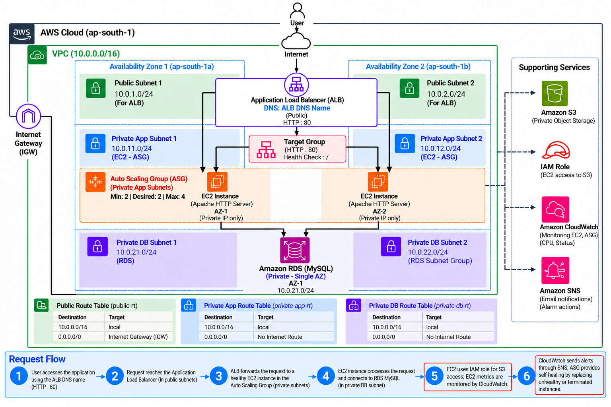

# AWS 3-Tier Web Application

## Project Overview

Designed and deployed a 3-tier web application architecture on AWS using VPC,
public and private subnets across two Availability Zones, Application Load
Balancer, EC2 Auto Scaling, and Amazon RDS MySQL.

The architecture follows the traffic flow:

Internet → ALB → Private EC2 → Private RDS

The project also includes IAM-based S3 access and CloudWatch/SNS monitoring.

## Architecture

## AWS Services Used

- Amazon VPC
- Amazon EC2
- Application Load Balancer
- Target Group
- Auto Scaling Group
- Amazon RDS MySQL
- Amazon S3
- IAM
- CloudWatch
- SNS

## Security

- ALB accepts HTTP traffic from the Internet.
- EC2 instances are deployed without public IP addresses.
- EC2 accepts HTTP traffic only from the ALB security group.
- RDS accepts MySQL traffic only from the application security group.
- S3 Block Public Access is enabled.
- EC2 uses an IAM role instead of long-term access keys.
- RDS encryption is enabled.

## Auto Scaling

- Minimum: 2
- Desired: 2
- Maximum: 4
- Application instances distributed across two Availability Zones.
- Self-healing verified by terminating an instance and observing automatic replacement.

## Testing

- ALB application access — Passed
- Target Group health — 2 Healthy
- ASG across 2 AZs — Verified
- ASG self-healing — Passed
- RDS private connectivity — Passed
- IAM role attached — Verified
- CloudWatch alarm & SNS email — Verified

## Future Improvements

- RDS Multi-AZ
- HTTPS using AWS Certificate Manager
- Custom domain using Route 53
